<h1 align="center">👋 Hello, I'm Darshan Navadiya</h1>

<h3 align="center">
  Full Stack Developer • MERN Stack • DevOps Learner
</h3>

<p align="center">
  
</p>

---

## 📊 GitHub Contributions

<p align="center">
  <picture>
    <source
      media="(prefers-color-scheme: dark)"
      srcset="https://raw.githubusercontent.com/navadiyadarshan/navadiyadarshan/output/github-contribution-grid-snake-dark.svg"
    />
    <source
      media="(prefers-color-scheme: light)"
      srcset="https://raw.githubusercontent.com/navadiyadarshan/navadiyadarshan/output/github-contribution-grid-snake.svg"
    />
    
  </picture>
</p>

---

## 📊 GitHub Stats

<p align="center">
  

  
</p>

---

## 🔥 GitHub Streak

<p align="center">
  
</p>

---

## 🚀 Currently Building

- 💰 **ExpensO** — Expense & Budget Management Platform
- 🌐 **ZarklyX** — Social Media & Agency Management Platform
- 📝 **Dream Words** — Full Stack Application
- 🛒 **Digi Store** — Ecommerce Application

---

## 🧠 Currently Learning

```text
Linux
Docker
DevOps
CI/CD
Cloud
Networking
Cybersecurity
System Administration
